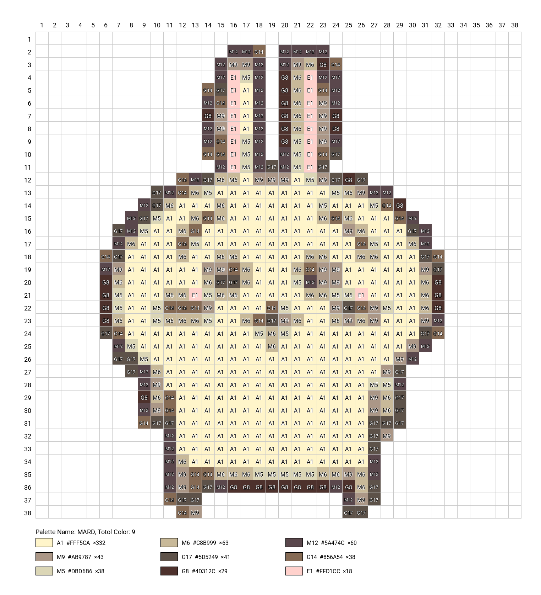

# Pixeler

Pixeler is a Python tool for pixelating images and mapping colors to bead palettes (e.g., Mard, Hama, Perler, Artkal, Nabbi). It generates a grid visualization with color legends, suitable for bead art planning.

## Features

- Pixelate images to a customizable grid size
- Reduce colors using KMeans clustering
- Map colors to predefined palettes from `assets/palettes.json`
- Visualize the result with grid, color labels, and legend
- Adjustable parameters for grid, font, and layout

## Usage

1. Place your input image in the `images/` folder.
2. Adjust parameters in [`main.py`](main.py) as needed (image path, palette, grid size, etc.).
3. Run the main script:

    ```sh
    python main.py
    ```

4. The output image will be saved in the `output/` folder.

## Files

- [`main.py`](main.py): Main script for pixelation and visualization
- [`toy_main.py`](toy_main.py): Minimal example for pixelation and color reduction
- [`utils.py`](utils.py): Utility functions for color and font handling
- [`assets/palettes.json`](assets/palettes.json): Predefined bead color palettes
- `images/`: Input images
- `output/`: Output images

## Requirements

- Python 3.10+
- Pillow
- numpy
- scikit-learn
- scipy

Install dependencies:

```sh
pip install pillow numpy scikit-learn scipy
```

## Customization

- Change `PALETTE_NAME` in [`main.py`](main.py) to use different palettes.
- Adjust grid size, color count, and visualization options in the script.

## Example


## License

MIT License